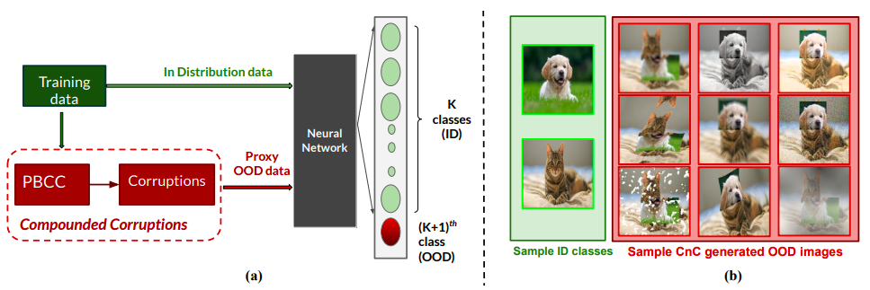

# A Novel Data Augmentation Technique for Out-of-Distribution Sample Detection using CompouNded Corruptions



Modern deep neural network models are known to erroneously classify
out-of-distribution (OOD) test data into one of the in-distribution (ID) training
classes with high confidence. This can have disastrous consequences for safety-
critical applications. A popular mitigation strategy is to train a separate classifier
that can detect such OOD samples at the test time. In most practical settings
OOD examples are not known at the train time, and hence a key question is how
to augment the ID data with synthetic OOD samples for training such an OOD
detector. In this paper, we propose a novel Compounded Corruption technique
for the OOD data augmentation. One of the major advantages of our technique,
named CnC, is that it does not require any hold-out data apart from the training set.
Further, unlike current state-of-the-art (SOTA) techniques, CnC does not require
backpropagation or ensembling at the test time, making our method much faster at
inference. Our extensive comparison with 20 methods from the major conferences
in last 4 years show that a model trained using CnC based data augmentation,
significantly outperforms SOTA, both in terms of OOD detection accuracy as well
as inference time. We include a detailed post-hoc analysis to investigate the reasons
for the success of our method and identify higher relative entropy and diversity
of CnC samples as probable causes. We also provide useful insights via a piece-
wise decomposition analysis on a two-dimensional dataset to reveal (visually and
quantitatively) that our approach leads to a tighter boundary around ID classes,
leading to better detection of OOD samples.

## Training scripts

Refer to `scripts` folder for more details.
To train CIFAR10 on ResNet-34 using CompoundedCorruptions (CnC), use the following command:

```bash
python train.py \
--dataset cifar10 \
--model resnet34 \
--wd 0.0005 \
--schedule-steps 100 150 \
--epochs 200 \
--aug cnc \
--exp_name ecml_run
```


## Evaluation scripts

```bash

```

## TODOs

- [ ] upload pretrained CnC models
- [ ] add evaluation scripts
- [ ] update readme with table and graphs etc.